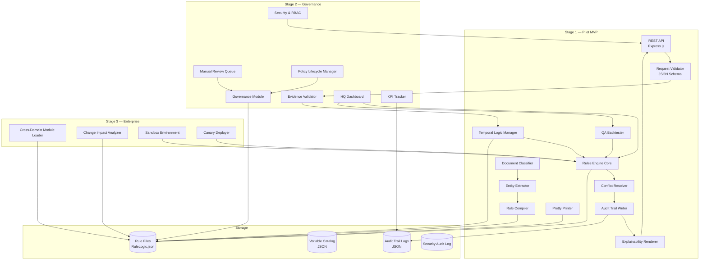
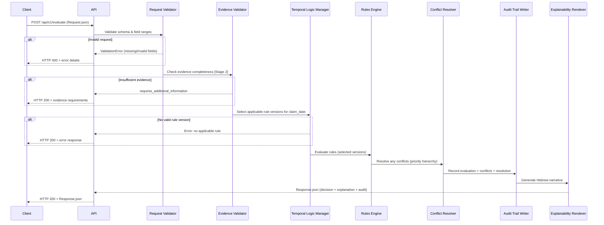
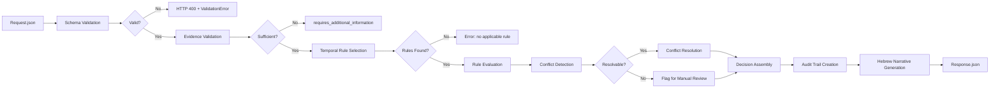
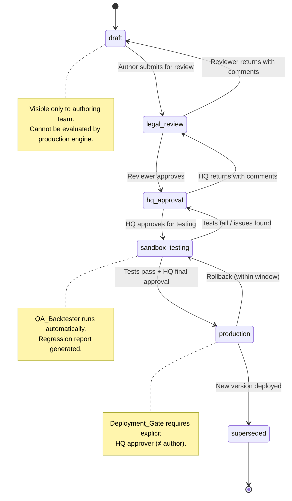

# Design Document — Mobility Rules-as-Code Engine

## Overview

מנוע כללים דטרמיניסטי ברמת ייצור עבור מחלקת הניידות של המוסד לביטוח לאומי.
המערכת מתרגמת מסמכים משפטיים, רגולטוריים ושיפוטיים למנוע מדיניות מבוסס כללים מכונתיים (Rules-as-Code), עם מעקב מלא, ציטוט משפטי, וניהול גרסאות.

The system is a deterministic, auditable rules engine that ingests Israeli National Insurance Institute (NII) policy documents — circulars, statutory agreements, judicial rulings — and compiles them into machine-executable rule definitions. It evaluates eligibility claims against these rules, producing fully traceable decisions with Hebrew-language explanations and complete legal citations.

### Design Rationale

- **Determinism over ML**: Every decision must be reproducible and legally defensible. No probabilistic models in the decision path.
- **File-based rules**: RuleLogic.json files stored on disk — auditable, version-controllable, human-reviewable.
- **Phased delivery**: Stage 1 (Pilot MVP) proves value with minimal scope before investing in governance and enterprise features.
- **Separation of concerns**: Core engine logic is domain-agnostic; mobility-specific rules are loaded as a domain module.

### Key Design Decisions

| Decision | Rationale |
|---|---|
| TypeScript/Node.js | Strong typing for rule schemas, rich JSON ecosystem, NII team familiarity |
| JSON Schema validation | Declarative, self-documenting, tooling-rich validation for all data contracts |
| File-based rule storage | Git-trackable, auditable, no database dependency for rules |
| In-memory evaluation | Sub-second response times for single evaluations |
| Express.js REST API | Lightweight, well-understood, sufficient for pilot throughput |
| Structured logging (JSON) | Machine-parseable audit trails, compatible with log aggregation |

**Validates: Requirements 1–22**

## Architecture

### System Component Diagram



### Data Flow — Request Evaluation Pipeline



**Validates: Requirements 4, 5, 6, 7, 8, 14, 17**

## Components and Interfaces

### Stage 1 Components

#### 1. Document Classifier (`DocumentClassifier`)

```typescript
interface DocumentClassifier {
  classify(document: RawDocument): ClassificationResult;
  extractMetadata(document: ClassifiedDocument): DocumentMetadata;
  extractCrossReferences(document: ClassifiedDocument): CrossReference[];
}

interface ClassificationResult {
  category: DocumentCategory;
  confidence: number; // 0.0–1.0
  flagged_for_review: boolean;
  review_reason?: string;
}

type DocumentCategory =
  | 'eligibility_rule'
  | 'procedural_rule'
  | 'legal_override'
  | 'judicial_override'
  | 'appeals_rule'
  | 'administrative_circular'
  | 'loan_agreement'
  | 'opinion_document';
```

**Validates: Requirement 1**

#### 2. Entity Extractor (`EntityExtractor`)

```typescript
interface EntityExtractor {
  extract(document: ClassifiedDocument): VariableCatalog;
  flagAmbiguous(term: string, location: SourceLocation): AmbiguousTerm;
}

interface VariableCatalog {
  variables: ExtractedVariable[];
  ambiguous_terms: AmbiguousTerm[];
}

interface ExtractedVariable {
  name: string;
  category: VariableCategory;
  data_type: 'string' | 'integer' | 'float' | 'boolean' | 'date' | 'enum';
  valid_range?: { min?: number; max?: number };
  enum_values?: string[];
  source: {
    document_id: string;
    page_number: number;
    section_reference: string;
  };
}

type VariableCategory =
  | 'demographic' | 'medical' | 'vehicle' | 'geographic'
  | 'legal' | 'procedural' | 'financial' | 'operational';
```

**Validates: Requirement 2**

#### 3. Rule Compiler (`RuleCompiler`)

```typescript
interface RuleCompiler {
  compile(interpretation: PolicyInterpretation): RuleDefinition;
  generateDecisionTree(rules: RuleDefinition[]): DecisionTree;
  validate(tree: DecisionTree): ValidationResult;
}

interface RuleCompilerParser {
  parse(json: string): RuleDefinition;        // RuleLogic.json → internal
  parseFile(path: string): RuleDefinition;
}

interface PrettyPrinter {
  format(rule: RuleDefinition): string;        // internal → RuleLogic.json
  formatResponse(response: ResponseSchema): string;
}
```

**Validates: Requirements 3, 15**

#### 4. Rules Engine Core (`RulesEngine`)

```typescript
interface RulesEngine {
  evaluate(request: RequestSchema): ResponseSchema;
  loadDomainModule(module: DomainModule): void;
  getActiveRules(): RuleMetadata[];
  getHealth(): HealthStatus;
}
```

**Validates: Requirements 4, 10, 14**

#### 5. Temporal Logic Manager (`TemporalLogicManager`)

```typescript
interface TemporalLogicManager {
  selectVersion(ruleId: string, claimDate: Date): RuleVersion;
  getVersionHistory(ruleId: string): RuleVersion[];
  supersede(ruleId: string, newVersion: RuleVersion): void;
}
```

**Validates: Requirement 5**

#### 6. Conflict Resolver (`ConflictResolver`)

```typescript
interface ConflictResolver {
  detect(evaluations: RuleEvaluation[]): Conflict[];
  resolve(conflict: Conflict): ConflictResolution;
}

interface ConflictResolution {
  winning_rule_id: string;
  losing_rule_ids: string[];
  resolution_method: 'priority_hierarchy' | 'lex_posterior' | 'manual_review';
  legal_basis: string;
}

// Priority: judicial_override > statutory > circular > procedural
type RulePriority = 'judicial_override' | 'statutory' | 'circular' | 'procedural';
```

**Validates: Requirement 6**

#### 7. Audit Trail Writer (`AuditTrailWriter`)

```typescript
interface AuditTrailWriter {
  create(evaluation: EvaluationContext): AuditTrail;
  // Audit trails are immutable — no update/delete methods
}
```

**Validates: Requirement 7**

#### 8. Explainability Renderer (`ExplainabilityRenderer`)

```typescript
interface ExplainabilityRenderer {
  render(evaluation: EvaluationContext, auditTrail: AuditTrail): string; // Hebrew narrative
}
```

**Validates: Requirement 8**

#### 9. QA Backtester (`QABacktester`)

```typescript
interface QABacktester {
  run(suite: TestSuite): BacktestReport;
  runTemporal(suite: TestSuite): BacktestReport; // uses historical rule versions
}

interface BacktestReport {
  total_cases_run: number;
  passed_count: number;
  failed_count: number;
  failure_rate_percentage: number;
  failures: TestFailure[];
}
```

**Validates: Requirement 9**

### Stage 2 Components

#### 10. Evidence Validator (`EvidenceValidator`)

```typescript
interface EvidenceValidator {
  validate(request: RequestSchema): EvidenceValidationResult;
  calculateQualityScore(request: RequestSchema): number; // 0.0–1.0
}
```

**Validates: Requirement 17**

#### 11. Manual Review Queue (`ManualReviewQueue`)

```typescript
interface ManualReviewQueue {
  route(caseContext: CaseContext, flagCategory: FlagCategory): void;
  complete(reviewId: string, decision: ReviewDecision): void;
  getAging(): AgingReport;
  escalate(reviewId: string): void;
}

type FlagCategory = 'legal' | 'medical' | 'procedural';
type AuthorityLevel = 'senior_legal_advisor' | 'legal_advisor' | 'senior_claims_officer' | 'claims_officer';
```

**Validates: Requirement 16**

#### 12. Policy Lifecycle Manager (`PolicyLifecycleManager`)

```typescript
interface PolicyLifecycleManager {
  transition(ruleId: string, toStage: LifecycleStage, userId: string): void;
  rollback(ruleId: string, reason: string, authorizerId: string): void;
}

type LifecycleStage = 'draft' | 'legal_review' | 'hq_approval' | 'sandbox_testing' | 'production' | 'superseded';
```

**Validates: Requirement 18**

#### 13. Governance Module (`GovernanceModule`)

```typescript
interface GovernanceModule {
  enforceRBAC(userId: string, action: GovernanceAction): boolean;
  enforceSeparationOfDuties(authorId: string, approverId: string): boolean;
  getMonthlyReviewSummary(month: Date): ReviewSummary;
}

type Role = 'system_admin' | 'policy_author' | 'legal_reviewer' | 'hq_approver' | 'claims_officer' | 'auditor' | 'api_consumer';
```

**Validates: Requirements 16, 18, 19**

### Stage 3 Components

#### 14. Cross-Domain Module Loader (`CrossDomainLoader`)

```typescript
interface CrossDomainLoader {
  loadModule(module: DomainModule): ValidationResult;
  validateSchema(module: DomainModule): SchemaValidationResult;
}
```

**Validates: Requirement 13**

#### 15. Change Impact Analyzer (`ChangeImpactAnalyzer`)

```typescript
interface ChangeImpactAnalyzer {
  analyze(proposedChange: RuleChange): ImpactReport;
}

interface ImpactReport {
  affected_claims_count: number;
  approvals_to_rejections: number;
  rejections_to_approvals: number;
  related_rules: string[];
}
```

**Validates: Requirements 20, 22**


## Data Models

### Policy Document Metadata Schema

```json
{
  "$schema": "http://json-schema.org/draft-07/schema#",
  "title": "PolicyDocumentMetadata",
  "type": "object",
  "required": ["document_id", "title", "document_date", "issuing_authority", "category", "classification_confidence"],
  "properties": {
    "document_id": { "type": "string", "format": "uuid" },
    "title": { "type": "string", "minLength": 1 },
    "document_date": { "type": "string", "format": "date" },
    "issuing_authority": { "type": "string" },
    "category": {
      "type": "string",
      "enum": ["eligibility_rule", "procedural_rule", "legal_override", "judicial_override", "appeals_rule", "administrative_circular", "loan_agreement", "opinion_document"]
    },
    "circular_number": { "type": ["string", "null"] },
    "referenced_legal_sections": {
      "type": "array",
      "items": { "type": "string" }
    },
    "cross_references": {
      "type": "array",
      "items": {
        "type": "object",
        "required": ["referenced_document_id", "reference_type"],
        "properties": {
          "referenced_document_id": { "type": "string" },
          "reference_type": { "type": "string", "enum": ["amends", "supersedes", "implements", "references", "overrides"] }
        }
      }
    },
    "classification_confidence": { "type": "number", "minimum": 0, "maximum": 1 },
    "flagged_for_review": { "type": "boolean" },
    "review_reason": { "type": ["string", "null"] },
    "ingestion_timestamp": { "type": "string", "format": "date-time" }
  }
}
```

**Validates: Requirements 1.1–1.5**

### Variable Catalog Schema

```json
{
  "$schema": "http://json-schema.org/draft-07/schema#",
  "title": "VariableCatalog",
  "type": "object",
  "required": ["catalog_id", "source_document_id", "variables"],
  "properties": {
    "catalog_id": { "type": "string", "format": "uuid" },
    "source_document_id": { "type": "string", "format": "uuid" },
    "extraction_timestamp": { "type": "string", "format": "date-time" },
    "variables": {
      "type": "array",
      "items": {
        "type": "object",
        "required": ["name", "category", "data_type", "source"],
        "properties": {
          "name": { "type": "string", "pattern": "^[a-z][a-z0-9_]*$" },
          "category": {
            "type": "string",
            "enum": ["demographic", "medical", "vehicle", "geographic", "legal", "procedural", "financial", "operational"]
          },
          "data_type": {
            "type": "string",
            "enum": ["string", "integer", "float", "boolean", "date", "enum"]
          },
          "valid_range": {
            "type": ["object", "null"],
            "properties": {
              "min": { "type": "number" },
              "max": { "type": "number" }
            }
          },
          "enum_values": {
            "type": ["array", "null"],
            "items": { "type": "string" }
          },
          "source": {
            "type": "object",
            "required": ["document_id", "page_number", "section_reference"],
            "properties": {
              "document_id": { "type": "string" },
              "page_number": { "type": "integer", "minimum": 1 },
              "section_reference": { "type": "string" }
            }
          }
        }
      }
    },
    "ambiguous_terms": {
      "type": "array",
      "items": {
        "type": "object",
        "required": ["term", "source_location", "reason"],
        "properties": {
          "term": { "type": "string" },
          "source_location": {
            "type": "object",
            "properties": {
              "document_id": { "type": "string" },
              "page_number": { "type": "integer" },
              "section_reference": { "type": "string" }
            }
          },
          "reason": { "type": "string" }
        }
      }
    }
  }
}
```

**Validates: Requirements 2.1–2.4**

### RuleLogic.json Schema

```json
{
  "$schema": "http://json-schema.org/draft-07/schema#",
  "title": "RuleDefinition",
  "type": "object",
  "required": ["rule_id", "rule_name", "source_document_id", "source_section", "effective_date", "conditions", "actions", "legal_citation", "priority"],
  "properties": {
    "rule_id": { "type": "string", "format": "uuid" },
    "rule_name": { "type": "string", "minLength": 1 },
    "source_document_id": { "type": "string", "format": "uuid" },
    "source_section": { "type": "string" },
    "effective_date": { "type": "string", "format": "date" },
    "expiry_date": { "type": ["string", "null"], "format": "date" },
    "priority": {
      "type": "string",
      "enum": ["judicial_override", "statutory", "circular", "procedural"]
    },
    "conditions": {
      "type": "object",
      "description": "Boolean expression tree over extracted variables",
      "required": ["type"],
      "properties": {
        "type": { "type": "string", "enum": ["AND", "OR", "NOT", "COMPARISON", "EXISTS"] },
        "operands": {
          "type": "array",
          "items": { "$ref": "#/properties/conditions" }
        },
        "variable": { "type": "string" },
        "operator": { "type": "string", "enum": ["eq", "neq", "gt", "gte", "lt", "lte", "in", "not_in", "between"] },
        "value": {}
      }
    },
    "actions": {
      "type": "array",
      "items": {
        "type": "object",
        "required": ["action_type"],
        "properties": {
          "action_type": {
            "type": "string",
            "enum": ["determine_eligibility", "calculate_amount", "refer_to_review", "require_additional_info"]
          },
          "parameters": { "type": "object" }
        }
      }
    },
    "legal_citation": {
      "type": "object",
      "required": ["document_name", "section", "paragraph"],
      "properties": {
        "document_name": { "type": "string" },
        "section": { "type": "string" },
        "paragraph": { "type": "string" },
        "clause": { "type": ["string", "null"] }
      }
    },
    "discretionary_flag": { "type": "boolean", "default": false },
    "discretionary_reason": { "type": ["string", "null"] },
    "decision_tree": { "$ref": "#/definitions/DecisionTreeNode" }
  },
  "definitions": {
    "DecisionTreeNode": {
      "type": "object",
      "required": ["node_id", "node_type"],
      "properties": {
        "node_id": { "type": "string" },
        "node_type": { "type": "string", "enum": ["condition", "leaf"] },
        "condition": { "$ref": "#/properties/conditions" },
        "true_branch": { "$ref": "#/definitions/DecisionTreeNode" },
        "false_branch": { "$ref": "#/definitions/DecisionTreeNode" },
        "outcome": {
          "type": "string",
          "enum": ["eligible", "not_eligible", "requires_discretion", "requires_additional_information"]
        },
        "legal_citation": { "$ref": "#/properties/legal_citation" },
        "depth": { "type": "integer", "minimum": 0, "maximum": 50 }
      }
    }
  }
}
```

**Validates: Requirements 3.1–3.6, 15.1–15.5**

### Request.json Schema

```json
{
  "$schema": "http://json-schema.org/draft-07/schema#",
  "title": "RequestSchema",
  "type": "object",
  "required": ["claimant_id", "claim_date", "claim_type"],
  "properties": {
    "claimant_id": { "type": "string", "minLength": 1 },
    "claim_date": { "type": "string", "format": "date" },
    "claim_type": {
      "type": "string",
      "enum": ["mobility_allowance", "vehicle_grant", "loan", "vehicle_less_allowance", "continued_payment"]
    },
    "demographic": {
      "type": "object",
      "properties": {
        "age": { "type": "integer", "minimum": 0, "maximum": 120 },
        "residency": { "type": "string" },
        "family_status": { "type": "string", "enum": ["single", "married", "divorced", "widowed"] }
      }
    },
    "medical": {
      "type": "object",
      "properties": {
        "disability_percentage": { "type": "number", "minimum": 0, "maximum": 100 },
        "mobility_limitation_type": { "type": "string" },
        "medical_institute_determination": { "type": "string" }
      }
    },
    "vehicle": {
      "type": "object",
      "properties": {
        "engine_volume": { "type": "integer", "minimum": 0 },
        "vehicle_type": { "type": "string" },
        "vehicle_age": { "type": "integer", "minimum": 0 },
        "qualifying_vehicle": { "type": "boolean" }
      }
    },
    "geographic": {
      "type": "object",
      "properties": {
        "residence_zone": { "type": "string" },
        "distance_to_services": { "type": "number", "minimum": 0 }
      }
    },
    "procedural": {
      "type": "object",
      "properties": {
        "claim_submission_date": { "type": "string", "format": "date" },
        "appeal_deadline": { "type": ["string", "null"], "format": "date" },
        "required_forms": { "type": "array", "items": { "type": "string" } }
      }
    },
    "operational": {
      "type": "object",
      "properties": {
        "institutional_residence_status": { "type": "boolean" },
        "driver_license_holder": { "type": "boolean" },
        "authorized_driver_status": { "type": "boolean" }
      }
    },
    "evidence": {
      "type": "array",
      "items": {
        "type": "object",
        "required": ["document_type", "document_date"],
        "properties": {
          "document_type": { "type": "string" },
          "document_date": { "type": "string", "format": "date" },
          "source": { "type": "string" }
        }
      }
    }
  }
}
```

**Validates: Requirements 4.1, 4.6**

### Response.json Schema

```json
{
  "$schema": "http://json-schema.org/draft-07/schema#",
  "title": "ResponseSchema",
  "type": "object",
  "required": ["request_id", "decision", "applied_rules", "processing_timestamp"],
  "properties": {
    "request_id": { "type": "string", "format": "uuid" },
    "decision": {
      "type": "string",
      "enum": ["eligible", "not_eligible", "partial", "pending_discretion", "requires_additional_information"]
    },
    "benefit_details": {
      "type": ["object", "null"],
      "properties": {
        "type": { "type": "string" },
        "amount": { "type": "number", "minimum": 0 },
        "duration": { "type": "string" },
        "conditions": { "type": "array", "items": { "type": "string" } }
      }
    },
    "applied_rules": {
      "type": "array",
      "items": {
        "type": "object",
        "required": ["rule_id", "legal_citation"],
        "properties": {
          "rule_id": { "type": "string" },
          "rule_version": { "type": "string" },
          "evaluation_result": { "type": "string" },
          "legal_citation": {
            "type": "object",
            "required": ["document_name", "section"],
            "properties": {
              "document_name": { "type": "string" },
              "section": { "type": "string" },
              "paragraph": { "type": "string" },
              "clause": { "type": ["string", "null"] }
            }
          }
        }
      }
    },
    "explanation_narrative": { "type": "string", "description": "Hebrew-language explanation" },
    "processing_timestamp": { "type": "string", "format": "date-time" },
    "data_quality_score": { "type": ["number", "null"], "minimum": 0, "maximum": 1 },
    "evidence_validation": {
      "type": ["object", "null"],
      "properties": {
        "missing_documents": { "type": "array", "items": { "type": "object" } },
        "contradictions": { "type": "array", "items": { "type": "object" } },
        "stale_documents": { "type": "array", "items": { "type": "object" } }
      }
    },
    "conflicts_resolved": {
      "type": "array",
      "items": {
        "type": "object",
        "properties": {
          "conflicting_rule_ids": { "type": "array", "items": { "type": "string" } },
          "winning_rule_id": { "type": "string" },
          "resolution_method": { "type": "string" },
          "legal_basis": { "type": "string" }
        }
      }
    },
    "discretionary_flags": {
      "type": "array",
      "items": {
        "type": "object",
        "properties": {
          "flag_category": { "type": "string" },
          "reason": { "type": "string" },
          "applicable_rule_id": { "type": "string" }
        }
      }
    }
  }
}
```

**Validates: Requirements 4.2, 4.5, 4.7**

### AuditTrail.json Schema

```json
{
  "$schema": "http://json-schema.org/draft-07/schema#",
  "title": "AuditTrail",
  "type": "object",
  "required": ["audit_id", "request_id", "claimant_id", "processing_timestamp", "evaluated_rules", "final_decision", "reasoning_chain"],
  "properties": {
    "audit_id": { "type": "string", "format": "uuid" },
    "request_id": { "type": "string", "format": "uuid" },
    "claimant_id": { "type": "string" },
    "processing_timestamp": { "type": "string", "format": "date-time" },
    "evaluated_rules": {
      "type": "array",
      "items": {
        "type": "object",
        "required": ["rule_id", "rule_version", "input_values", "evaluation_result", "legal_citation", "evaluation_order", "evaluation_time_ms"],
        "properties": {
          "rule_id": { "type": "string" },
          "rule_version": { "type": "string" },
          "input_values": { "type": "object" },
          "evaluation_result": { "type": "string" },
          "legal_citation": {
            "type": "object",
            "required": ["document_name", "section", "paragraph"],
            "properties": {
              "document_name": { "type": "string" },
              "section": { "type": "string" },
              "paragraph": { "type": "string" },
              "clause": { "type": ["string", "null"] }
            }
          },
          "evaluation_order": { "type": "integer", "minimum": 1 },
          "evaluation_time_ms": { "type": "number", "minimum": 0 }
        }
      }
    },
    "conflicts": {
      "type": "array",
      "items": {
        "type": "object",
        "required": ["conflicting_rule_ids", "resolution_method", "winning_rule_id", "legal_basis"],
        "properties": {
          "conflicting_rule_ids": { "type": "array", "items": { "type": "string" } },
          "resolution_method": { "type": "string" },
          "winning_rule_id": { "type": "string" },
          "legal_basis": { "type": "string" }
        }
      }
    },
    "final_decision": { "type": "string" },
    "reasoning_chain": {
      "type": "array",
      "items": {
        "type": "object",
        "properties": {
          "step": { "type": "integer" },
          "description": { "type": "string" },
          "rule_id": { "type": "string" },
          "result": { "type": "string" }
        }
      }
    },
    "evidence_validation": {
      "type": ["object", "null"],
      "properties": {
        "items_checked": {
          "type": "array",
          "items": {
            "type": "object",
            "required": ["evidence_type", "status", "legal_requirement"],
            "properties": {
              "evidence_type": { "type": "string" },
              "status": { "type": "string", "enum": ["present", "missing", "stale", "contradictory"] },
              "legal_requirement": { "type": "string" }
            }
          }
        }
      }
    },
    "immutable": { "type": "boolean", "const": true }
  }
}
```

**Validates: Requirements 7.1–7.5**

### Rule Version Schema

```json
{
  "$schema": "http://json-schema.org/draft-07/schema#",
  "title": "RuleVersion",
  "type": "object",
  "required": ["version_id", "rule_id", "effective_start_date", "source_amendment"],
  "properties": {
    "version_id": { "type": "string", "format": "uuid" },
    "rule_id": { "type": "string", "format": "uuid" },
    "effective_start_date": { "type": "string", "format": "date" },
    "effective_end_date": { "type": ["string", "null"], "format": "date" },
    "source_amendment": {
      "type": "object",
      "required": ["document_id", "document_name"],
      "properties": {
        "document_id": { "type": "string" },
        "document_name": { "type": "string" },
        "circular_number": { "type": ["string", "null"] }
      }
    },
    "rule_definition": { "$ref": "RuleLogic.json" },
    "lifecycle_stage": {
      "type": "string",
      "enum": ["draft", "legal_review", "hq_approval", "sandbox_testing", "production", "superseded"]
    },
    "created_by": { "type": "string" },
    "approved_by": { "type": ["string", "null"] },
    "deployment_timestamp": { "type": ["string", "null"], "format": "date-time" }
  }
}
```

**Validates: Requirements 5.1–5.5, 18.1**

### Governance Schema

```json
{
  "$schema": "http://json-schema.org/draft-07/schema#",
  "title": "GovernanceRecord",
  "type": "object",
  "required": ["record_id", "record_type", "timestamp", "user_id"],
  "properties": {
    "record_id": { "type": "string", "format": "uuid" },
    "record_type": {
      "type": "string",
      "enum": ["lifecycle_transition", "manual_review", "override", "deployment", "rollback", "access_event"]
    },
    "timestamp": { "type": "string", "format": "date-time" },
    "user_id": { "type": "string" },
    "user_role": {
      "type": "string",
      "enum": ["system_admin", "policy_author", "legal_reviewer", "hq_approver", "claims_officer", "auditor", "api_consumer"]
    },
    "details": {
      "type": "object",
      "properties": {
        "rule_id": { "type": "string" },
        "from_stage": { "type": "string" },
        "to_stage": { "type": "string" },
        "reason": { "type": "string" },
        "legal_basis": { "type": "string" },
        "override_of_automated_decision": { "type": ["string", "null"] }
      }
    }
  }
}
```

**Validates: Requirements 16, 18, 19**

### Manual Review Record Schema

```json
{
  "$schema": "http://json-schema.org/draft-07/schema#",
  "title": "ManualReviewRecord",
  "type": "object",
  "required": ["review_id", "request_id", "flag_category", "status", "created_at"],
  "properties": {
    "review_id": { "type": "string", "format": "uuid" },
    "request_id": { "type": "string", "format": "uuid" },
    "flag_category": { "type": "string", "enum": ["legal", "medical", "procedural"] },
    "status": { "type": "string", "enum": ["pending", "in_review", "completed", "escalated"] },
    "assigned_reviewer_id": { "type": ["string", "null"] },
    "reviewer_authority_level": {
      "type": ["string", "null"],
      "enum": [null, "senior_legal_advisor", "legal_advisor", "senior_claims_officer", "claims_officer"]
    },
    "created_at": { "type": "string", "format": "date-time" },
    "completed_at": { "type": ["string", "null"], "format": "date-time" },
    "decision": { "type": ["string", "null"] },
    "reasoning": { "type": ["string", "null"] },
    "override_of_automated": { "type": "boolean", "default": false },
    "override_justification": { "type": ["string", "null"] },
    "override_legal_citation": { "type": ["string", "null"] },
    "sla_threshold_hours": { "type": "number" },
    "escalated": { "type": "boolean", "default": false }
  }
}
```

**Validates: Requirements 16.1–16.6**

### Evidence Validation Result Schema

```json
{
  "$schema": "http://json-schema.org/draft-07/schema#",
  "title": "EvidenceValidationResult",
  "type": "object",
  "required": ["request_id", "data_quality_score", "items"],
  "properties": {
    "request_id": { "type": "string", "format": "uuid" },
    "data_quality_score": { "type": "number", "minimum": 0, "maximum": 1 },
    "is_sufficient": { "type": "boolean" },
    "items": {
      "type": "array",
      "items": {
        "type": "object",
        "required": ["evidence_type", "status"],
        "properties": {
          "evidence_type": { "type": "string" },
          "status": { "type": "string", "enum": ["present", "missing", "stale", "contradictory"] },
          "legal_requirement_reference": { "type": "string" },
          "reason": { "type": ["string", "null"] },
          "freshness_threshold_days": { "type": ["integer", "null"] },
          "document_date": { "type": ["string", "null"], "format": "date" }
        }
      }
    }
  }
}
```

**Validates: Requirements 17.1–17.6**

### KPI Metrics Schema

```json
{
  "$schema": "http://json-schema.org/draft-07/schema#",
  "title": "KPIMetrics",
  "type": "object",
  "required": ["timestamp", "processing", "quality", "governance", "business"],
  "properties": {
    "timestamp": { "type": "string", "format": "date-time" },
    "processing": {
      "type": "object",
      "properties": {
        "average_processing_time_ms": { "type": "number", "minimum": 0 },
        "p95_processing_time_ms": { "type": "number", "minimum": 0 },
        "requests_per_day": { "type": "integer", "minimum": 0 },
        "error_rate_percentage": { "type": "number", "minimum": 0, "maximum": 100 },
        "uptime_percentage": { "type": "number", "minimum": 0, "maximum": 100 }
      }
    },
    "quality": {
      "type": "object",
      "properties": {
        "manual_override_rate": { "type": "number", "minimum": 0, "maximum": 100 },
        "false_rejection_rate": { "type": "number", "minimum": 0, "maximum": 100 },
        "decision_consistency_score": { "type": "number", "minimum": 0, "maximum": 100 }
      }
    },
    "governance": {
      "type": "object",
      "properties": {
        "average_rule_deployment_time_days": { "type": "number", "minimum": 0 },
        "regression_test_pass_rate": { "type": "number", "minimum": 0, "maximum": 100 },
        "policy_update_frequency": { "type": "number", "minimum": 0 },
        "rollback_count": { "type": "integer", "minimum": 0 }
      }
    },
    "business": {
      "type": "object",
      "properties": {
        "rights_uptake_rate": { "type": "number", "minimum": 0, "maximum": 100 },
        "average_claim_processing_days": { "type": "number", "minimum": 0 },
        "operational_cost_per_decision": { "type": "number", "minimum": 0 }
      }
    }
  }
}
```

**Validates: Requirements 21.1–21.5**


## Core Engine Design

### Rule Evaluation Pipeline

The evaluation pipeline processes a request through a deterministic sequence of stages. Each stage is a pure function (or near-pure with audit side-effects), making the pipeline testable and traceable.



**Validates: Requirements 4, 5, 6, 7, 8, 17**

### Decision Tree Traversal Algorithm

```typescript
/**
 * Traverses a decision tree deterministically.
 * Every path terminates at a leaf node within max depth 50.
 * Each node is linked to a legal citation for full traceability.
 */
function traverseDecisionTree(
  tree: DecisionTreeNode,
  variables: Record<string, unknown>,
  auditSteps: AuditStep[],
  depth: number = 0
): DecisionOutcome {
  if (depth > 50) {
    throw new RuleEngineError('Decision tree exceeds maximum depth of 50');
  }

  if (tree.node_type === 'leaf') {
    auditSteps.push({
      step: auditSteps.length + 1,
      description: `Reached leaf: ${tree.outcome}`,
      node_id: tree.node_id,
      result: tree.outcome,
      legal_citation: tree.legal_citation,
    });
    return {
      outcome: tree.outcome, // 'eligible' | 'not_eligible' | 'requires_discretion' | 'requires_additional_information'
      legal_citation: tree.legal_citation,
      discretionary: tree.outcome === 'requires_discretion',
    };
  }

  const conditionResult = evaluateCondition(tree.condition, variables);

  auditSteps.push({
    step: auditSteps.length + 1,
    description: `Evaluated condition: ${tree.condition.variable} ${tree.condition.operator} ${tree.condition.value}`,
    node_id: tree.node_id,
    result: String(conditionResult),
    legal_citation: tree.legal_citation,
  });

  const nextBranch = conditionResult ? tree.true_branch : tree.false_branch;
  return traverseDecisionTree(nextBranch, variables, auditSteps, depth + 1);
}
```

**Validates: Requirements 3.2, 3.4**

### Conflict Resolution Algorithm

```typescript
/**
 * Priority hierarchy: judicial_override > statutory > circular > procedural
 * Tie-breaking: lex posterior (later effective_start_date wins)
 * Unresolvable: two judicial_overrides with contradictory holdings → manual review
 */
const PRIORITY_ORDER: Record<RulePriority, number> = {
  judicial_override: 4,
  statutory: 3,
  circular: 2,
  procedural: 1,
};

function resolveConflict(
  evaluations: RuleEvaluation[]
): ConflictResolution {
  // Group by outcome to find contradictions
  const outcomes = new Map<string, RuleEvaluation[]>();
  for (const eval of evaluations) {
    const key = eval.outcome;
    if (!outcomes.has(key)) outcomes.set(key, []);
    outcomes.get(key)!.push(eval);
  }

  if (outcomes.size <= 1) {
    return { no_conflict: true };
  }

  // Sort all evaluations by priority (desc), then by effective_start_date (desc)
  const sorted = [...evaluations].sort((a, b) => {
    const priorityDiff = PRIORITY_ORDER[b.priority] - PRIORITY_ORDER[a.priority];
    if (priorityDiff !== 0) return priorityDiff;
    return new Date(b.effective_start_date).getTime() - new Date(a.effective_start_date).getTime();
  });

  const winner = sorted[0];
  const losers = sorted.slice(1);

  // Check for unresolvable: multiple judicial_overrides with different outcomes
  const judicialOverrides = sorted.filter(e => e.priority === 'judicial_override');
  const judicialOutcomes = new Set(judicialOverrides.map(e => e.outcome));
  if (judicialOutcomes.size > 1) {
    return {
      resolvable: false,
      conflicting_rule_ids: judicialOverrides.map(e => e.rule_id),
      reason: 'Multiple judicial overrides with contradictory holdings',
    };
  }

  return {
    resolvable: true,
    winning_rule_id: winner.rule_id,
    losing_rule_ids: losers.map(e => e.rule_id),
    resolution_method: winner.priority !== losers[0]?.priority ? 'priority_hierarchy' : 'lex_posterior',
    legal_basis: `${winner.priority} takes precedence (${winner.legal_citation.document_name} §${winner.legal_citation.section})`,
  };
}
```

**Validates: Requirements 6.1–6.4**

### Temporal Logic Selection Algorithm

```typescript
/**
 * Selects the rule version whose effective date range contains the claim_date.
 * Invariant: effective_start_date <= claim_date AND (effective_end_date IS NULL OR claim_date <= effective_end_date)
 */
function selectRuleVersion(
  ruleId: string,
  claimDate: Date,
  versions: RuleVersion[]
): RuleVersion {
  const ruleVersions = versions
    .filter(v => v.rule_id === ruleId && v.lifecycle_stage === 'production')
    .sort((a, b) => new Date(b.effective_start_date).getTime() - new Date(a.effective_start_date).getTime());

  for (const version of ruleVersions) {
    const start = new Date(version.effective_start_date);
    const end = version.effective_end_date ? new Date(version.effective_end_date) : null;

    if (claimDate >= start && (end === null || claimDate <= end)) {
      return version;
    }
  }

  throw new TemporalError(
    `No applicable rule version found for rule ${ruleId} on claim date ${claimDate.toISOString()}`
  );
}
```

**Validates: Requirements 5.2, 5.4**

## API Design

### REST Endpoints

| Method | Path | Description | Stage | Auth |
|---|---|---|---|---|
| `POST` | `/api/v1/evaluate` | Submit eligibility evaluation request | 1 | api_consumer |
| `GET` | `/api/v1/health` | Health check with loaded modules and rule counts | 1 | public |
| `GET` | `/api/v1/rules` | List active rules with versions and metadata | 2 | auditor+ |
| `GET` | `/api/v1/rules/:ruleId/versions` | Version history for a specific rule | 2 | auditor+ |
| `POST` | `/api/v1/backtest` | Run backtesting suite | 1 | policy_author+ |
| `POST` | `/api/v1/simulate` | Simulate evaluation (no audit trail) | 2 | hq_approver+ |
| `GET` | `/api/v1/metrics` | KPI metrics (JSON/CSV) | 2 | system_admin |
| `POST` | `/api/v1/governance/transition` | Transition rule lifecycle stage | 2 | policy_author+ |
| `POST` | `/api/v1/governance/rollback` | Rollback production rule | 2 | hq_approver |
| `POST` | `/api/v1/documents/ingest` | Upload and classify policy document | 1 | policy_author |

### Request/Response Formats

**POST /api/v1/evaluate**

Request: `Request.json` schema (see Data Models)

Response (success):
```json
{
  "status": "success",
  "data": { /* Response.json schema */ },
  "audit_trail_id": "uuid",
  "processing_time_ms": 142
}
```

Response (validation error):
```json
{
  "status": "error",
  "error": {
    "code": "VALIDATION_ERROR",
    "message": "Request validation failed",
    "details": [
      { "field": "claim_type", "error": "missing_required_field", "expected_type": "string" },
      { "field": "demographic.age", "error": "out_of_range", "provided": -5, "acceptable_range": { "min": 0, "max": 120 } }
    ]
  }
}
```

**GET /api/v1/health**

```json
{
  "status": "healthy",
  "engine_version": "1.0.0",
  "loaded_domains": ["mobility"],
  "active_rule_versions": 47,
  "uptime_seconds": 86400,
  "timestamp": "2024-01-15T10:30:00Z"
}
```

### Error Handling

| HTTP Code | Condition | Error Code |
|---|---|---|
| 400 | Malformed JSON, missing Content-Type | `MALFORMED_REQUEST` |
| 400 | Schema validation failure | `VALIDATION_ERROR` |
| 401 | Missing or invalid authentication | `UNAUTHORIZED` |
| 403 | Insufficient role permissions | `FORBIDDEN` |
| 404 | Rule or resource not found | `NOT_FOUND` |
| 500 | Internal engine error | `INTERNAL_ERROR` |

All error responses follow the structure:
```json
{
  "status": "error",
  "error": {
    "code": "ERROR_CODE",
    "message": "Human-readable description",
    "details": []
  }
}
```

### Authentication/Authorization Model

Stage 1 uses API key authentication with role mapping. Stage 2 introduces full RBAC.

```typescript
interface AuthConfig {
  // Stage 1: API key → role mapping
  api_keys: Record<string, { role: Role; description: string }>;
  // Stage 2: JWT-based with role claims
  jwt_issuer?: string;
  jwt_audience?: string;
}

// Role permission matrix
const PERMISSIONS: Record<Role, string[]> = {
  system_admin:    ['*'],
  policy_author:   ['evaluate', 'backtest', 'ingest', 'transition:draft', 'transition:legal_review'],
  legal_reviewer:  ['evaluate', 'backtest', 'transition:hq_approval', 'rules:read'],
  hq_approver:     ['evaluate', 'simulate', 'transition:production', 'rollback', 'rules:read'],
  claims_officer:  ['evaluate'],
  auditor:         ['evaluate', 'rules:read', 'metrics:read', 'audit:read'],
  api_consumer:    ['evaluate'],
};
```

**Validates: Requirements 14.1–14.5, 19.1–19.2**

## Governance Design

### Policy Lifecycle State Machine



### Valid State Transitions

```typescript
const VALID_TRANSITIONS: Record<LifecycleStage, LifecycleStage[]> = {
  draft:            ['legal_review'],
  legal_review:     ['draft', 'hq_approval'],
  hq_approval:      ['legal_review', 'sandbox_testing'],
  sandbox_testing:  ['hq_approval', 'production'],
  production:       ['superseded', 'sandbox_testing'], // sandbox_testing = rollback
  superseded:       [],
};
```

### Approval Workflow

1. **Author** creates rule in `draft` stage
2. **Author** transitions to `legal_review` → system notifies assigned legal reviewer
3. **Legal reviewer** reviews, either returns to `draft` or approves to `hq_approval`
4. **HQ approver** reviews, either returns to `legal_review` or approves to `sandbox_testing`
5. **System** automatically runs QA_Backtester in sandbox
6. **HQ approver** (must be different from author — separation of duties) approves to `production`
7. **System** records deployment with full audit trail

### Separation of Duties Enforcement

```typescript
function enforceSeparationOfDuties(
  ruleId: string,
  approverId: string,
  governanceLog: GovernanceRecord[]
): boolean {
  const authorRecord = governanceLog.find(
    r => r.details.rule_id === ruleId && r.details.to_stage === 'draft'
  );
  if (!authorRecord) return true;
  return authorRecord.user_id !== approverId;
}
```

### Sandbox Testing Architecture

- Sandbox is an isolated in-memory instance of the Rules Engine
- Loads production rules + proposed changes
- QA_Backtester runs all historical test cases against the sandbox
- Results are compared to production outcomes
- Regression report is generated and attached to the governance record

### Deployment Pipeline

```
draft → legal_review → hq_approval → sandbox_testing → [canary 5%] → production
                                                              ↑
                                                        Stage 3 only
```

Stage 1–2: Direct sandbox → production (no canary).
Stage 3: Canary deployment with configurable percentage and observation period.

**Validates: Requirements 18.1–18.7, 19.6, 22.3–22.4**

## Technology Stack

| Layer | Technology | Rationale |
|---|---|---|
| Runtime | Node.js 20 LTS + TypeScript 5.x | Strong typing, JSON-native, NII team familiarity |
| API Framework | Express.js (Stage 1), migrate to Fastify if needed | Lightweight, well-understood |
| Schema Validation | Ajv (JSON Schema) | Fast, standards-compliant, rich error messages |
| Rule Storage | File system (JSON files) | Git-trackable, auditable, no DB dependency |
| Audit Logging | Structured JSON to file system | Machine-parseable, append-only |
| Testing | Vitest + fast-check (property-based) | Fast, TypeScript-native, PBT support |
| OCR (Stage 1) | Tesseract.js (Hebrew) | Open-source, local processing |
| Security (Stage 2) | JWT + bcrypt | Standard, well-audited |
| Monitoring (Stage 2) | Prometheus metrics endpoint | Standard, integrates with existing NII infra |

### Project Structure

```
mobility-rules-engine/
├── src/
│   ├── core/                    # Domain-agnostic engine
│   │   ├── engine.ts            # RulesEngine main class
│   │   ├── evaluator.ts         # Decision tree traversal
│   │   ├── temporal.ts          # TemporalLogicManager
│   │   ├── conflict.ts          # ConflictResolver
│   │   ├── audit.ts             # AuditTrailWriter
│   │   ├── validator.ts         # Request/schema validation
│   │   └── types.ts             # Core type definitions
│   ├── compiler/                # Rule compilation pipeline
│   │   ├── compiler.ts          # RuleCompiler
│   │   ├── parser.ts            # JSON → internal representation
│   │   ├── printer.ts           # Internal → JSON (PrettyPrinter)
│   │   └── tree-builder.ts      # Decision tree generation
│   ├── ingestion/               # Document processing
│   │   ├── classifier.ts        # DocumentClassifier
│   │   ├── extractor.ts         # EntityExtractor
│   │   └── ocr.ts               # OCR preprocessing
│   ├── explainability/          # Hebrew narrative generation
│   │   ├── renderer.ts          # ExplainabilityRenderer
│   │   └── templates/           # Hebrew narrative templates
│   ├── qa/                      # Quality assurance
│   │   └── backtester.ts        # QABacktester
│   ├── api/                     # REST API layer
│   │   ├── server.ts            # Express app setup
│   │   ├── routes.ts            # Route definitions
│   │   ├── middleware/           # Auth, validation, error handling
│   │   └── handlers/            # Request handlers
│   ├── governance/              # Stage 2: Governance module
│   │   ├── lifecycle.ts         # PolicyLifecycleManager
│   │   ├── review-queue.ts      # ManualReviewQueue
│   │   ├── rbac.ts              # Role-based access control
│   │   └── evidence.ts          # EvidenceValidator
│   └── domains/                 # Domain-specific modules
│       └── mobility/            # Mobility domain rules
│           ├── rules/           # RuleLogic.json files
│           ├── variables/       # Variable catalog JSON
│           └── module.ts        # Domain module definition
├── schemas/                     # JSON Schema definitions
│   ├── request.schema.json
│   ├── response.schema.json
│   ├── rule-logic.schema.json
│   ├── audit-trail.schema.json
│   └── ...
├── test/
│   ├── unit/                    # Unit tests
│   ├── property/                # Property-based tests (fast-check)
│   ├── integration/             # API integration tests
│   └── fixtures/                # Test data and historical cases
├── data/
│   ├── rules/                   # Production rule files
│   ├── audit/                   # Audit trail logs
│   └── test-cases/              # QA backtesting cases
└── docs/
    └── api/                     # API documentation
```

## Phased Build Plan

### Stage 1 — Pilot MVP

**Goal**: Prove the engine works for `vehicle_less_allowance` (Circular 1810) and basic `mobility_allowance`.

| Component | Scope | Priority |
|---|---|---|
| Rule Compiler + Parser + Pretty Printer | Full round-trip for pilot rules | P0 |
| Request/Response Schema Validation | Full schema, limited claim_types | P0 |
| Rules Engine Core | Single-domain evaluation | P0 |
| Temporal Logic Manager | Basic version selection | P0 |
| Conflict Resolver | Priority hierarchy (limited conflicts) | P0 |
| Audit Trail Writer | Full audit from day one | P0 |
| Explainability Renderer | Template-based Hebrew narratives | P1 |
| Document Classifier | PDF ingestion for 3 circulars | P1 |
| Entity Extractor | Variables for pilot scope | P1 |
| QA Backtester | Manual test cases (10+ scenarios) | P1 |
| REST API | `/evaluate` + `/health` | P0 |

### Stage 2 — Governance Maturity

| Component | Scope | Depends On |
|---|---|---|
| Mobility Rules (expanded) | All 5 benefit types, all circulars, Amendment 24 | Stage 1 |
| Judicial Overrides | All court rulings encoded | Stage 1 |
| Appeals Logic | Full appeals and withdrawal rules | Stage 1 + Judicial |
| Evidence Validator | Completeness, contradictions, staleness, quality scoring | Stage 1 schemas |
| Manual Review Queue | Routing, authority hierarchy, SLA tracking | Stage 1 audit |
| Policy Lifecycle Manager | Full state machine with approval workflow | Stage 1 |
| Governance Module (RBAC) | Role-based access, separation of duties | Stage 1 API |
| HQ Dashboard | Simulation, comparison, confidence scoring | Stage 2 governance |
| KPI Tracker | All 4 KPI categories | Stage 2 operations |
| Security | JWT auth, encryption, security audit log | Stage 1 API |

### Stage 3 — Enterprise Expansion

| Component | Scope | Depends On |
|---|---|---|
| Cross-Domain Module Loader | Multi-domain support, schema validation | Stage 2 |
| Change Impact Analyzer | Automated impact analysis for new documents | Stage 2 lifecycle |
| Sandbox Environment (parallel) | Isolated parallel testing | Stage 2 |
| Canary Deployer | Staged deployment (5% → 100%) | Stage 2 lifecycle |
| Continuous Ingestion Pipeline | Automated classify → impact → draft → test → deploy | Stage 2 + Stage 3 |
| Rule Metadata API | Full rule browsing and version history | Stage 2 + Req 13 |


## Correctness Properties

*A property is a characteristic or behavior that should hold true across all valid executions of a system — essentially, a formal statement about what the system should do. Properties serve as the bridge between human-readable specifications and machine-verifiable correctness guarantees.*

### Property 1: RuleLogic.json Round-Trip

*For any* valid RuleLogic.json object, parsing it into an internal representation and then pretty-printing it back to JSON and parsing again SHALL produce an equivalent internal representation.

**Validates: Requirements 3.6, 15.3**

### Property 2: Request Schema Round-Trip

*For any* valid Request.json object, serializing then deserializing SHALL produce an equivalent object.

**Validates: Requirements 4.6**

### Property 3: Response Schema Round-Trip

*For any* valid Response.json object, serializing then deserializing SHALL produce an equivalent object.

**Validates: Requirements 4.7**

### Property 4: Audit Trail Round-Trip

*For any* valid AuditTrail.json object, serializing then deserializing SHALL produce an equivalent object.

**Validates: Requirements 7.5**

### Property 5: Document Classification Produces Exactly One Valid Category

*For any* uploaded Policy_Document, the Document_Classifier SHALL return exactly one category from the defined category enum, and the classification confidence SHALL be a number between 0.0 and 1.0.

**Validates: Requirements 1.1, 1.3**

### Property 6: Low-Confidence Classification Triggers Manual Review

*For any* classification result with a confidence score at or below 0.7, the document SHALL be flagged for manual review with a recorded reason.

**Validates: Requirements 1.3**

### Property 7: Extracted Variables Have Valid Types and Source References

*For any* extracted variable in the variable catalog, it SHALL have a valid data_type from the defined enum, a non-empty source reference (document_id, page_number, section_reference), and either a valid_range or enum_values appropriate to its data_type.

**Validates: Requirements 2.1, 2.2, 2.4**

### Property 8: Decision Tree Leaf Nodes Produce Deterministic Outcomes

*For any* generated Decision_Tree, every leaf node SHALL have an outcome that is exactly one of: `eligible`, `not_eligible`, `requires_discretion`, or `requires_additional_information`.

**Validates: Requirements 3.2**

### Property 9: Decision Tree Maximum Depth Invariant

*For any* generated Decision_Tree, no path from root to leaf SHALL exceed 50 nodes in depth.

**Validates: Requirements 3.4**

### Property 10: Discretionary Conditions Are Flagged

*For any* rule containing a condition that requires human judgment, the corresponding Decision_Tree node SHALL be marked with a Discretionary_Flag set to true, and the node SHALL be excluded from automated resolution.

**Validates: Requirements 3.3**

### Property 11: Request Validation Detects All Missing and Invalid Fields

*For any* Request.json with missing required fields or out-of-range values, the validation error response SHALL list every missing field with its expected type, and every invalid field with the provided value and acceptable range. The set of reported violations SHALL exactly match the set of actual violations.

**Validates: Requirements 4.3, 4.4**

### Property 12: Temporal Rule Selection Correctness

*For any* rule_id and claim_date, the Temporal_Logic_Manager SHALL select a Rule_Version whose effective_start_date is less than or equal to the claim_date AND whose effective_end_date is either null or greater than or equal to the claim_date. If no such version exists, an error SHALL be returned.

**Validates: Requirements 5.2, 5.4**

### Property 13: Rule Version Temporal Invariant

*For any* Rule_Version, the effective_start_date SHALL always be present, and if effective_end_date is present, it SHALL be greater than or equal to effective_start_date.

**Validates: Requirements 5.1**

### Property 14: Supersession Creates Valid Version Chain

*For any* rule supersession event, the previous Rule_Version SHALL have its effective_end_date set, and the new Rule_Version SHALL have an effective_start_date that is after the previous version's effective_end_date. The version history SHALL contain both versions.

**Validates: Requirements 5.3**

### Property 15: Conflict Resolution Respects Priority Hierarchy

*For any* set of conflicting rules with different priority levels, the Conflict_Resolver SHALL select the rule with the highest priority (judicial_override > statutory > circular > procedural) as the winner. For rules with equal priority, the rule with the later effective_start_date SHALL win (lex posterior).

**Validates: Requirements 6.1, 6.3**

### Property 16: Conflict Resolution Audit Completeness

*For any* resolved conflict, the Audit_Trail SHALL contain the conflicting rule_ids, the resolution method, the winning rule_id, and the legal basis for the priority determination.

**Validates: Requirements 6.2**

### Property 17: Audit Trail Completeness

*For any* processed request, the generated AuditTrail.json SHALL contain: request_id, claimant_id, processing_timestamp, at least one evaluated rule (each with rule_id, rule_version, input_values, evaluation_result, legal_citation with section/paragraph/clause, evaluation_order, and evaluation_time_ms), the final_decision, and a non-empty reasoning_chain.

**Validates: Requirements 7.1, 7.2, 7.3**

### Property 18: Audit Trail Immutability

*For any* existing AuditTrail record, any attempt to modify or delete the record SHALL be rejected. The audit trail is append-only.

**Validates: Requirements 7.4**

### Property 19: Explainability Contains Legal Citations

*For any* Response_Schema with applied rules, the explanation_narrative SHALL contain a reference to every rule's legal citation (document_name and section) that contributed to the decision.

**Validates: Requirements 8.1, 8.4**

### Property 20: Discretionary Flags Appear in Explanation

*For any* decision path containing a Discretionary_Flag, the explanation_narrative SHALL explicitly state which aspects require human review and the reason for referral.

**Validates: Requirements 8.3**

### Property 21: Backtesting Report Consistency

*For any* backtesting run, the summary report SHALL satisfy: passed_count + failed_count = total_cases_run, failure_rate_percentage = (failed_count / total_cases_run) * 100, and the list of failing test_case_ids SHALL have exactly failed_count entries.

**Validates: Requirements 9.4**

### Property 22: Backtesting Discrepancy Reports Are Complete

*For any* test case that produces a different outcome than expected, the discrepancy report SHALL contain: test_case_id, expected_decision, actual_decision, differing_rules, and the specific rule_version that caused the divergence.

**Validates: Requirements 9.2**

### Property 23: Temporal Backtesting Uses Correct Rule Versions

*For any* historical test case with a claim_date, the QA_Backtester in temporal mode SHALL evaluate using the Rule_Versions that were effective on that claim_date, not the current production versions.

**Validates: Requirements 9.3**

### Property 24: Schema Validation Error Reporting

*For any* RuleLogic.json file with syntax errors, the parser SHALL return an error specifying line number, character position, and nature of the error. For schema violations, the validator SHALL list each violation with field path and expected constraint.

**Validates: Requirements 15.4, 15.5**

### Property 25: Manual Review Routing Matches Flag Category

*For any* case with a Discretionary_Flag, the Manual_Review_Queue SHALL route the case to a reviewer whose specialization matches the flag category (legal → legal reviewer, medical → medical reviewer, procedural → procedural reviewer).

**Validates: Requirements 16.1**

### Property 26: Manual Override Governance

*For any* manual override that contradicts the automated determination, the Governance_Module SHALL require and record: reviewer_id, review_timestamp, decision, written justification, legal basis, and the original automated decision. The reviewer's authority level must be sufficient for the override scope.

**Validates: Requirements 16.2, 16.3, 16.4**

### Property 27: Evidence Validation Completeness

*For any* Request_Schema, the Evidence_Validator SHALL check all required supporting documents for the claim_type, detect contradictions between data fields, check staleness against freshness thresholds, and assign a data_quality_score between 0.0 and 1.0. All validation results SHALL be recorded in the Audit_Trail.

**Validates: Requirements 17.1, 17.2, 17.3, 17.5, 17.6**

### Property 28: Policy Lifecycle State Machine Validity

*For any* rule lifecycle transition, the transition SHALL only be allowed if it follows the valid state machine transitions (draft→legal_review→hq_approval→sandbox_testing→production→superseded, with allowed returns). Draft rules SHALL NOT be visible to the production engine. Production deployment SHALL require explicit HQ approval from a user who is not the rule author.

**Validates: Requirements 18.1, 18.2, 18.5, 19.6**

### Property 29: RBAC Enforcement

*For any* access attempt, the Rules_Engine SHALL enforce role-based access control where: only policy_author and legal_reviewer can edit rules, only hq_approver can approve production deployment, and each role's permissions are restricted to its defined scope.

**Validates: Requirements 19.1, 19.2**

### Property 30: Malformed API Request Rejection

*For any* HTTP request with invalid JSON or missing Content-Type header, the REST API SHALL return HTTP 400 with a descriptive error message containing the error code and human-readable description.

**Validates: Requirements 14.5**

### Property 31: Cross-Domain Module Schema Validation

*For any* domain module loaded into the Rules_Engine, the module's schema SHALL be validated against the core engine schema, and any violations SHALL be reported before activation. Version histories and audit trails SHALL be maintained separately per domain.

**Validates: Requirements 13.2, 13.3, 13.4**

### Property 32: Historical Recalculation Temporal Consistency

*For any* historical recalculation request, the Rules_Engine SHALL evaluate using the Rule_Versions that were effective at the original claim_date, producing the same result as would have been produced at that time.

**Validates: Requirements 22.6**


## Error Handling

### Error Categories

| Category | HTTP Code | Handling Strategy | Example |
|---|---|---|---|
| **Validation Errors** | 400 | Return structured error with all violations | Missing `claim_type`, age out of range |
| **Temporal Errors** | 200 | Return error in response body | No rule version for claim_date |
| **Conflict Errors** | 200 | Flag for manual review, include partial result | Unresolvable judicial override conflict |
| **Evidence Errors** | 200 | Return `requires_additional_information` with evidence list | Missing medical assessment |
| **Auth Errors** | 401/403 | Reject with error code | Invalid API key, insufficient role |
| **Parse Errors** | 400 | Return line/character/description | Malformed RuleLogic.json |
| **Engine Errors** | 500 | Log full context, return generic error | Decision tree exceeds max depth |

### Error Response Structure

All errors follow a consistent structure:

```typescript
interface EngineError {
  code: string;           // Machine-readable error code
  message: string;        // Human-readable description (Hebrew for citizen-facing)
  details: ErrorDetail[]; // Specific violation details
  timestamp: string;      // ISO 8601
  request_id?: string;    // For traceability
}

interface ErrorDetail {
  field?: string;         // JSON path to problematic field
  error_type: string;     // 'missing_required' | 'out_of_range' | 'invalid_type' | 'parse_error' | 'schema_violation'
  provided_value?: unknown;
  expected?: string;      // Expected type, range, or constraint
  line?: number;          // For parse errors
  character?: number;     // For parse errors
}
```

### Error Propagation

- Validation errors are returned immediately — no partial evaluation
- Evidence validation errors return `requires_additional_information` with full context
- Temporal errors are per-rule — if one rule has no valid version, the error is reported but other rules continue evaluation
- Conflict errors that cannot be resolved deterministically flag for manual review but still return a partial result
- All errors are recorded in the Audit Trail for traceability

### Graceful Degradation

- If the Explainability Renderer fails, the response is still returned with `explanation_narrative: null` and an error flag
- If audit trail writing fails, the evaluation result is still returned but the response includes a warning and the system retries audit writing asynchronously
- If evidence validation is unavailable (Stage 1), the pipeline skips that step and proceeds with evaluation

**Validates: Requirements 4.3, 4.4, 5.4, 6.4, 14.5, 15.4, 15.5, 17.4**

## Testing Strategy

### Dual Testing Approach

This system uses both unit tests and property-based tests for comprehensive coverage:

- **Unit tests** (Vitest): Specific examples, edge cases, integration points, domain-specific legal scenarios
- **Property-based tests** (fast-check via Vitest): Universal properties across all valid inputs

### Property-Based Testing Configuration

- Library: **fast-check** (TypeScript-native, integrates with Vitest)
- Minimum **100 iterations** per property test
- Each property test references its design document property
- Tag format: `Feature: mobility-rules-engine, Property {N}: {title}`

### Test Categories

#### Property-Based Tests (32 properties)

All correctness properties defined above are implemented as property-based tests using fast-check. Each test generates random valid inputs and verifies the property holds universally.

Key property test groups:
1. **Round-trip properties** (Properties 1–4): Serialization/deserialization for all JSON schemas
2. **Structural invariants** (Properties 5–10): Classification, variable extraction, decision tree structure
3. **Validation properties** (Properties 11, 24, 30): Request validation, parse errors, API errors
4. **Temporal properties** (Properties 12–14, 23, 32): Rule version selection, supersession, historical recalculation
5. **Conflict resolution** (Properties 15–16): Priority hierarchy, lex posterior, audit completeness
6. **Audit and traceability** (Properties 17–20): Audit completeness, immutability, explainability
7. **Backtesting** (Properties 21–23): Report consistency, discrepancy reporting, temporal correctness
8. **Governance** (Properties 25–29, 31): Manual review routing, RBAC, lifecycle state machine

#### Unit Tests (Example-Based)

| Area | Test Focus | Req |
|---|---|---|
| Mobility eligibility rules | Specific circulars (1810, 2056, 1996, 2132) with known outcomes | 10 |
| Judicial overrides | Each court ruling (Shoshana Levy, Shaked Arueti, Galit Lavi, Ruth Hadaya) | 11 |
| Appeals logic | Appeal filing, withdrawal (Circular 1984), duplicate detection (Circular 1936) | 12 |
| Amendment 24 | Before/after amendment effective date scenarios | 10.3 |
| Institutionalized claimants | Vehicle-less allowance for institutional residents | 10.4 |
| Hebrew narrative | Readability and completeness of generated explanations | 8.2 |

#### Integration Tests

| Area | Test Focus | Req |
|---|---|---|
| REST API | End-to-end request/response through API | 14 |
| Health endpoint | Returns correct status, modules, rule counts | 14.3 |
| OCR pipeline | Hebrew PDF ingestion with OCR | 1.5 |
| Performance | Single evaluation < 2000ms | 14.2 |
| Sandbox backtesting | Automatic backtester execution on sandbox transition | 18.4 |

#### Smoke Tests

| Area | Test Focus | Req |
|---|---|---|
| Health check | API starts and responds | 14.3 |
| Rule loading | Domain module loads without errors | 13.1 |
| Encryption config | AES-256 at rest, TLS 1.2+ in transit | 19.5 |

### Test Data Strategy

- **Generators** (fast-check): Random valid/invalid Request.json, RuleLogic.json, AuditTrail.json, Response.json objects
- **Fixtures**: Historical test cases from NII mobility department (anonymized)
- **Edge cases**: Empty fields, maximum depth trees, conflicting judicial overrides, temporal gaps, stale evidence
- **Hebrew content**: Generators include Hebrew strings for narrative and citation testing

**Validates: Requirements 9.1–9.4, and all correctness properties**
